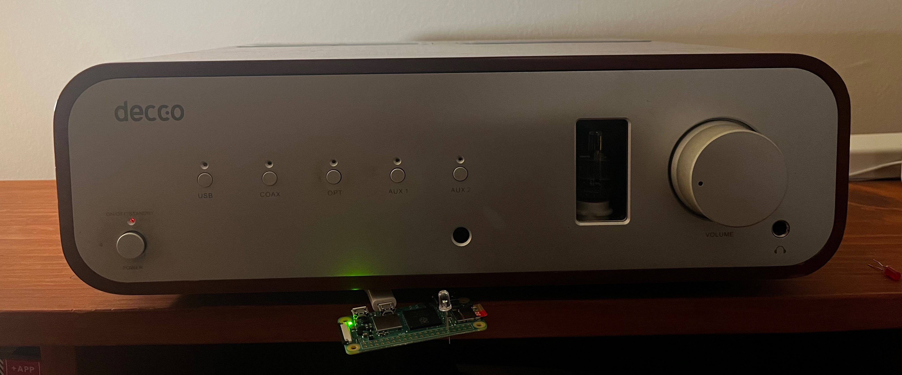
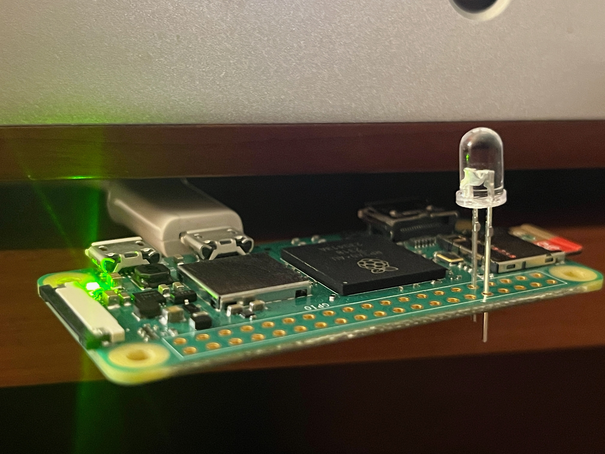
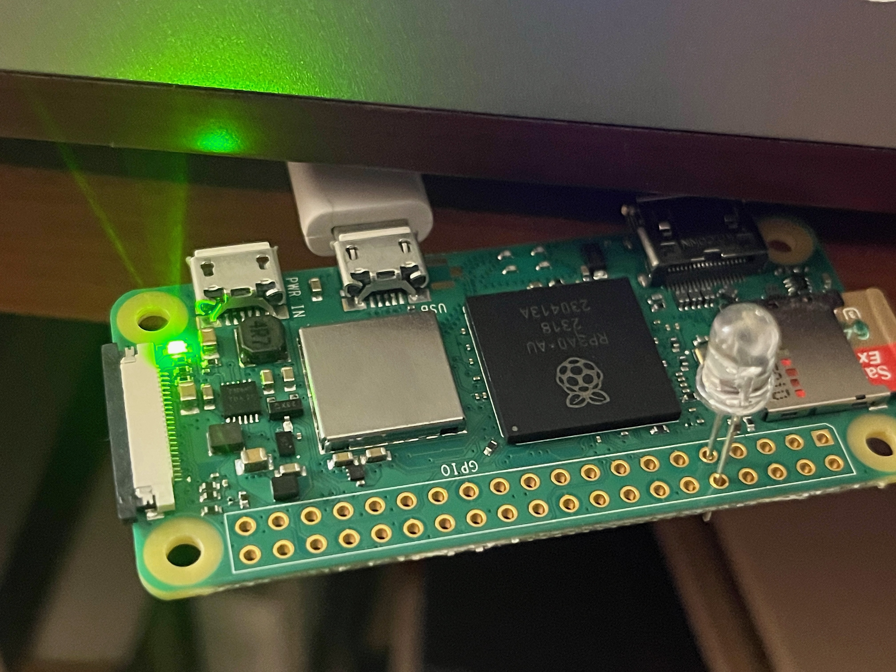

Automating my Peachtree Decco with a Hifiberry and a Raspberry Pi IR Remote



I have a Peachtree Decco amplifier. Great amplifier with a single tube for it pre-amp stage from 2008. But is has 2 annoyances. 
1) The input USB port broke. Got it fixed once, but didn't bother the second time. And 
2) When turning it one, the volume and channel selector need to be operated manually. 

To solve for the broken USB input port, i attached a raspberry pi with a hifiberry DAC, that runs hifiberry OS. This way i can play whatever i like on the stereo remotely. Spotify, airplay, roon, etc.

But now i can play audio remotely, i also want the amplifier to turn on automatically. Hence the creation of this project


This project automates the control of a Peachtree Decco amplifier ususing a secondary Raspberry Pi as a bridge, using LIRC (Linux Infrared Remote Control) to send and receive IR signals, and controlling the amplifier’s functions such as volume, input selection, and power state. It fetches the state from the hifiberry pi. 

This setup includes features for automatically turning the amplifier on and off based on the presence of audio signals, ensuring a seamless integration with your audio system.


Pre-requisites:
- Peachtree Decco amplifier
- Raspberry pi with a hifiberry DAC hat attached to the Decco
- Another raspberry PI, to be the IR remote. I used the pi zero 2W
- IR LED
- Resister and transister, if you want the IR to work over long distance.


Steps:

- install rasbpian on your raspberry pi. 
- log in to the raspberry pi
- install LIRC
apt install lirc

- enable GPIO pins, by adding the following two lines to /boot/firmware/config.txt
dtoverlay=gpio-ir,gpio_pin=18
dtoverlay=gpio-ir-tx,gpio_pin=15

- add the LIRC modules, using pin 18 and 15 for in- and output
lirc_dev
lirc_rpi gpio_in_pin=18  gpio_out_pin=15
to /dev/modules

- edit the /etc/lirc/lirc_options.conf to use the driver line to point to the default driver:
driver          = default 


- install the python script
chmod +x decco-pi-led-hifiberry.py
cp decco-pi-led-hifiberry.py /usr/local/bin/
cp decco.lircd.con /etc/lirc/lircd.conf.d/
cp decco-pi-led-hifiberry.service /etc/systemd/system/decco-pi-led-hifiberry.service

- reboot to get the GPIO pins config to take affect


- now it is time to see if LIRC works. Try running this command to see if LIRC is configured correctly
irsend SEND_ONCE decco AUX1

if the command finished without an error, the pi is configured correctly. If you still get an Input/output error, then the LIRC/config pins is not yet complete.

- Now connect the IR LED, the long leg into the Pin 15, and the short leg into the ground.  For the prototype, no soldering is required.  For debugging, you can also put in a regular LED in the some holes to visually see if the IR signals are being sent.



- as an optional step, you can also add a transistor and a resistor to brighten the LED so that it can cover larger distances.


- Generate an SSH key for the current user and root user
ssh-keygen
ssh-copy-id root@<hostnamename of hifiberry>
sudo ssh-keygen
sudo ssh-copy-id root@<hostnamename of hifiberry>


- test out the deamon by running from the command line. Adjust the variables as needed.
/usr/local/bin/decco-pi-led-hifiberry.py


- if it works as intended, then add the script to systemd so that it get started as part of the OS
systemctl daemon-reload
systemctl enable decco-pi-led-hifiberry
systemctl start decco-pi-led-hifiberry


Optional steps:
- apt-get update && apt-get -y upgrade
- enable automatic software updates


### Automating my Peachtree Decco with a Hifiberry and a Raspberry Pi IR Remote

This project automates the control of a Peachtree Decco amplifier using a Raspberry Pi with a Hifiberry DAC and a secondary Raspberry Pi configured as an IR remote. The goal is to integrate modern streaming capabilities (Spotify, AirPlay, Roon, etc.) with the Peachtree Decco and automate power and input controls.

The Peachtree Decco amplifier is known for its excellent sound, but it has a few limitations:
1. The USB input port is prone to breaking. Mine broke twice. Didn't bother to fix it the second time.
2. Volume and input selection need to be manually adjusted after powering on.

To solve the broken USB issue, I added a Raspberry Pi running Hifiberry OS, allowing me to stream audio remotely. To further automate the process, I created this project to manage power and input switching automatically based on audio signals detected from the Hifiberry.

This setup includes features for automatically turning the amplifier on and off based on whether audio is playing, ensuring seamless integration with your audio system.

### Prerequisites
- Peachtree Decco amplifier
- Raspberry Pi with a Hifiberry DAC HAT attached to the Decco
- Another Raspberry Pi (e.g., Pi Zero 2W) to act as the IR remote
- IR LED
- Optional Resistor and transistor (for long-distance IR signaling)

### Steps

1. **Set up the Raspberry Pi:**
   - Install Raspberry Pi OS (Raspbian) on the Pi.
   - Log in to the Raspberry Pi.

2. **Install LIRC:**
   ```bash
   sudo apt install lirc
   ```

3. **Enable GPIO pins for IR:**
   Add the following lines to `/boot/firmware/config.txt`:
   ```bash
   dtoverlay=gpio-ir,gpio_pin=18
   dtoverlay=gpio-ir-tx,gpio_pin=15
   ```

4. **Configure LIRC modules:**
   Add the following to `/etc/modules` to use pin 18 and 15 for IR input/output:
   ```bash
   lirc_dev
   lirc_rpi gpio_in_pin=18 gpio_out_pin=15
   ```

5. **Edit LIRC configuration:**
   Edit `/etc/lirc/lirc_options.conf` and set the driver to default:
   ```bash
   driver = default
   ```

6. **Install the Python script:**
   Make the script executable and copy it to the correct directories:
   ```bash
   cp decco-pi-led-hifiberry.py /usr/local/bin/
   chmod +x /usr/local/bin/decco-pi-led-hifiberry.py
   cp decco.lircd.conf /etc/lirc/lircd.conf.d/
   cp decco-pi-led-hifiberry.service /etc/systemd/system/decco-pi-led-hifiberry.service
   ```

7. **Reboot the Raspberry Pi:**
   Reboot to apply the GPIO configuration changes:
   ```bash
   sudo reboot
   ```

8. **Test LIRC:**
   Run the following command to test if LIRC is working:
   ```bash
   irsend SEND_ONCE decco AUX1
   ```
   If no errors occur, the IR configuration is probably correct. If you see an Input/Output error, double-check the LIRC and GPIO setup.

9. **Connect the IR LED:**
   - Connect the long leg of the IR LED to GPIO Pin 15, and the short leg to ground.
   - Optionally, add a transistor and a resistor for longer-range IR signals.

10. **Set up SSH for Hifiberry communication:**
   To be able to log into the hifiberry, you need to enable SSH in the hifiberry. Then on the IR raspberry pi, generate and copy the SSH key for the current and root user, so that you can log into the hifiberry without a password:
   ```bash
   ssh-keygen
   ssh-copy-id root@<hifiberry-hostname>
   sudo ssh-keygen
   sudo ssh-copy-id root@<hifiberry-hostname>
   ```

11. **Test the Python script:**
   adjust the configuration parameters in the scipt
   Test the daemon by running the script manually:
   ```bash
   /usr/local/bin/decco-pi-led-hifiberry.py
   ```
   Also test it as root, as that is what the script runs at.
   ```bash
   sudo /usr/local/bin/decco-pi-led-hifiberry.py
   ```
   

12. **Set up the script as a systemd service:**
   Enable the script to start automatically with the system:
   ```bash
   sudo systemctl daemon-reload
   sudo systemctl enable decco-pi-led-hifiberry
   sudo systemctl start decco-pi-led-hifiberry
   sudo systemctl status decco-pi-led-hifiberry
   ```

### Optional Steps:
- Keep the Raspberry Pi up to date:
   ```bash
   sudo apt-get update && sudo apt-get -y upgrade
   ```
- Enable automatic software updates.

This project brings modern convenience to the Peachtree Decco amplifier, combining Raspberry Pi hardware with automation for a fully integrated audio experience.


